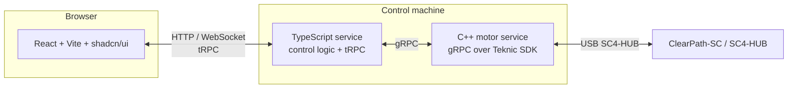

# Technical documentation — inverted pendulum (real-pendulum-2)

This document describes the intended software architecture for controlling a motor on a linear rail as part of an inverted-pendulum experiment. Hardware assumed: Teknic ClearPath-SC servos on an SC4-HUB (USB), as used in the vendor’s C++ SDK examples.

---

## 1. Goals

| Phase | Goal |
|--------|------|
| **Phase 1** | End-to-end stack with manual **jog** control (left/right along the rail) from a web UI. |
| **Later** | Closed-loop inverted-pendulum control (state estimation, control law, safety limits). |

Phase 1 validates: motor API ↔ control service ↔ browser, without requiring balance control.

---

## 2. High-level architecture



**Rationale for three layers**

- **C++ gRPC service**: Teknic’s ClearView SDK is C++ (`pubSysCls.h`, `SysManager`, `INode`). Keeping USB/hub access and real-time-friendly motion calls in one long-lived process avoids FFI complexity in Node.
- **TypeScript service**: Application logic (future estimator/controller), configuration, and a **tRPC** API that maps cleanly onto React hooks and shared types.
- **React frontend**: Operator UI; Phase 1 focuses on a **jogger** (velocity or step jog) with clear stop/emergency semantics.

---

## 3. Repository layout (proposed monorepo)

```
real-pendulum-2/
  apps/
    motor-grpc/          # C++ executable + .proto; links Teknic SDK + gRPC
    control-api/         # Node/TypeScript: tRPC server + gRPC client to motor-grpc
    web/                 # React + Vite + TypeScript + Tailwind + shadcn/ui
  packages/
    shared-types/        # optional: Zod schemas / types shared control-api ↔ web
  docs/
    TECHDOC.md           # this file
```

Naming is illustrative; adjust to your tooling (pnpm/npm workspaces, Turborepo, etc.).

---

## 4. Module A — C++ motor service (`motor-grpc`)

### 4.1 Vendor SDK reference

Installed examples (this machine):

`C:\Program Files (x86)\Teknic\ClearView\sdk\beta-cpp-examples-windows\`

| Example folder | Relevance |
|----------------|-----------|
| **MotionVelocity** | Velocity moves via `MoveVelStart` — primary reference for **rail jog** (run at commanded velocity until stop). |
| **PositionMoves** | Positional moves via `MovePosnStart` — relative/absolute moves in counts; useful for indexed steps later. |
| **SingleThreaded(Polling)** | `Axis` wrapper pattern — optional structure for a single node/state machine. |

Typical startup sequence (from those examples):

1. `SysManager::Instance()`, `SysManager::FindComHubPorts`, `ComHubPort`, `PortsOpen`.
2. Select `INode` (e.g. first node on port 0).
3. Set units/limits (`AccUnit`, `VelUnit`, `Motion.AccLimit`, `Motion.VelLimit` as needed).
4. `NodeStopClear`, `AlertsClear`, `EnableReq(true)`, wait until `Motion.IsReady()`.
5. Issue motion: **velocity** `Motion.MoveVelStart(rpm)` or **position** `Motion.MovePosnStart(...)`.

For **jog**, velocity mode matches “hold button → move; release → stop” better than queued position segments. Implement **stop** as `MoveVelStart(0)` or documented stop APIs per SDK (verify against current Teknic headers for your firmware).

### 4.2 gRPC responsibilities

Expose a small, explicit surface (exact messages TBD during implementation):

- **Lifecycle**: connect/open hub, enable/disable axis, read nominal state (enabled, alerts, position feedback if needed).
- **Jog**: `SetJogVelocity(signed)` or separate left/right with magnitude; **stop** must be idempotent and fast.
- **Telemetry** (optional for Phase 1): streaming position/velocity status for UI display.

Use **one blocking-queue or strand** inside the service so Teknic API calls never run concurrently from multiple gRPC threads unless the SDK documents thread safety.

### 4.3 Build notes

- Link against Teknic libraries and include paths from the ClearView SDK installation.
- Add gRPC / protobuf generated sources from `.proto` files; pin compiler/toolchain (MSVC) consistently with prebuilt SDK binaries.

---

## 5. Module B — TypeScript control API (`control-api`)

### 5.1 Role

- **tRPC router** for the frontend: typed procedures for jog start/stop, limits, and status.
- **gRPC client** to `motor-grpc` for all hardware actions.
- Future: pendulum state (IMU/encoder), PID or LQR, logging — **not** required for Phase 1.

### 5.2 Suggested boundaries

- Keep **no Teknic types** here — only your protobuf-generated types and domain types.
- Map gRPC errors to tRPC errors with stable codes for the UI (disconnected, fault, limit hit).

### 5.3 Transport

- tRPC with **HTTP batch** or **WebSocket** adapter (choose based on subscription needs for telemetry).
- CORS and optional auth if the API is ever exposed beyond localhost.

---

## 6. Module C — Frontend (`web`)

### 6.1 Stack

- **React**, **Vite**, **TypeScript**, **Tailwind CSS**, **shadcn/ui**.

### 6.2 Phase 1 UI — jogger

Minimal operator controls:

- **Jog left** / **Jog right**: pointer-down → command velocity; pointer-up / leave → stop (mirror physical jog pendants).
- **Emergency stop** / **Stop**: always visible; calls stop on the control API.
- Optional: velocity slider or preset “slow / medium,” soft limits (software rail limits) enforced in TS or C++.

Use accessible buttons, debounce network chatter if needed, and assume latency — **release must stop** even if the last command was delayed.

---

## 7. Configuration

Centralize:

- gRPC address/port for `motor-grpc` (default `127.0.0.1:<port>`).
- Hub/node selection if multiple devices exist (Phase 1 can fix node 0).

Avoid committing secrets; use env files locally.

---

## 8. Safety and operational notes

- Treat the linear rail as **crush and pinch** hazards; software limits do not replace mechanical end stops where required.
- Ensure **ClearView** or other hub-exclusive programs are closed when `motor-grpc` owns the port (Teknic examples mention port contention).
- Log alerts/faults from the node and surface them in the UI.

---

## 9. Implementation order (recommended)

1. **motor-grpc**: open hub, enable axis, gRPC `Stop` + `SetJogVelocity`, manual test with `grpcurl`.
2. **control-api**: tRPC wrappers + integration test against running motor service (mock optional).
3. **web**: jogger wired to tRPC; test full loop with hardware on a cleared bench.

---

## 10. References

- Teknic ClearPath-SC user manuals (linked from vendor example headers).
- Local SDK examples: `beta-cpp-examples-windows` (especially **MotionVelocity**, **PositionMoves**).

---

## Document history

| Date | Change |
|------|--------|
| 2026-05-02 | Initial architecture and Phase 1 jog scope. |
