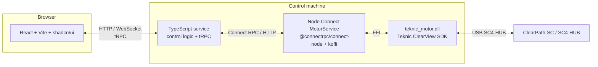

# Technical documentation — inverted pendulum (real-pendulum-2)

This document describes the intended software architecture for controlling a motor on a linear rail as part of an inverted-pendulum experiment. Hardware assumed: Teknic ClearPath-SC servos on an SC4-HUB (USB), as used in the vendor’s C++ SDK examples.

**Related:** simulation without hardware, bench (real vs sim), and coupled cart–pendulum physics are described in [`simulation-and-bench.md`](./simulation-and-bench.md).

---

## 1. Goals

| Phase | Goal |
|--------|------|
| **Phase 1** | End-to-end stack with manual **jog** control (left/right along the rail) from a web UI. |
| **Later** | Closed-loop inverted-pendulum control (state estimation, control law, safety limits). |

Phase 1 validates: motor API ↔ control service ↔ browser, without requiring balance control.

---

## 2. High-level architecture



**Rationale for three layers**

- **Motor service** (folder **`apps/motor-service`**, npm **`@real-pendulum/motor-service`**): **gRPC** exposes `motor.v1.MotorService`. **koffi** loads **`teknic_motor.dll`**, which links Teknic’s C++ SDK (`SysManager`, `INode`) for hub access and motion. One Node process holds the gRPC server and the DLL handle.
- **TypeScript control API**: Application logic (future estimator/controller), configuration, and a **tRPC** API that maps cleanly onto React hooks and shared types.
- **React frontend**: Operator UI; Phase 1 focuses on a **jogger** (velocity or step jog) with clear stop/emergency semantics.

---

## 3. Repository layout (proposed monorepo)

```
real-pendulum-2/
  apps/
    motor-service/       # @real-pendulum/motor-service — Node gRPC + teknic_motor.dll + proto/
    sensor-service/      # @real-pendulum/sensor-service — serial / Sensor Board; gRPC sensor.v1
    control-api/         # tRPC server + gRPC clients to motor + sensor services
    web/                 # React + Vite + TypeScript + Tailwind + shadcn/ui
  packages/
    motor-proto/         # Buf-generated motor + sensor protobufs
    physics-sim/         # MuJoCo HTTP service + `@real-pendulum/physics-sim/client` TS bridge
  docs/
    TECHDOC.md
    simulation-and-bench.md
```

Naming is illustrative; adjust to your tooling (pnpm/npm workspaces, Turborepo, etc.).

---

## 4. Module A — Motor service (`apps/motor-service`, `@real-pendulum/motor-service`)

The live implementation uses **Node** (`src/server.ts`) for gRPC and a **CMake-built DLL** (`native/teknic_motor/`) for Teknic I/O. The sections below still describe **vendor SDK behavior** used inside the DLL.

### 4.1 Vendor SDK reference

Installed examples (ClearView SDK default location):

`C:\Program Files (x86)\Teknic\ClearView\sdk\beta-cpp-examples-windows`

| Example folder | Relevance |
|----------------|-----------|
| **MotionVelocity** | Velocity moves via `MoveVelStart` — primary reference for **rail jog** (run at commanded velocity until stop). |
| **PositionMoves** | Positional moves via `MovePosnStart` — relative/absolute moves in counts; useful for indexed steps later. |
| **SingleThreaded(Polling)** | `Axis` wrapper pattern — optional structure for a single node/state machine. |

Typical startup sequence (from those examples):

1. `SysManager::Instance()`, then manual **`ComHubPort(0, comNum)`**, **`FindComHubPorts`** + per-hub **`ComHubPort`**, or (Windows, empty discovery) **COM index sweep** **`kComPortScanMin..Max`** until **`NodeCount() ≥ 1`**, then **`PortsOpen`**. Discovery filters **SC4‑HUB USB** only; motor diagnostic USB usually needs manual COM or the sweep.
2. `PortsOpen`.
3. Select `INode` (e.g. first node on port 0).
4. Set units/limits in the same order as **`MotionVelocity.cpp`**: **`AccUnit`**, **`Motion.AccLimit`**, **`VelUnit`** (then optional **`Motion.VelLimit`** etc. as in **`SingleThreaded`/Axis** examples).
5. `NodeStopClear`, `AlertsClear`, `EnableReq(true)`, wait until `Motion.IsReady()`.
6. Issue motion: **velocity** `Motion.MoveVelStart(rpm)` or **position** `Motion.MovePosnStart(...)`.

For **jog**, velocity mode matches “hold button → move; release → stop” better than queued position segments. Implement **stop** as `MoveVelStart(0)` or documented stop APIs per SDK (verify against current Teknic headers for your firmware).

### 4.2 gRPC surface (implemented)

Defined by **`proto/motor.proto`** — **Connect**, **Disconnect**, **SetJogVelocity**, **Stop**, **GetStatus**. Node loads generated service definitions via **`@grpc/proto-loader`** (see **`src/loadMotorService.ts`**).

### 4.3 Native build notes

- Configure **`TEKNIC_SDK_ROOT`** (see **`apps/motor-service/native/README.md`**) so CMake finds Teknic headers and **`sFoundation20`** import libs / DLL copy rules.
- **`npm run build:native -w @real-pendulum/motor-service`** runs **`scripts/build-native.mjs`** (CMake: Visual Studio 2022 then 2026 generator fallback on Windows, Release; **`motor.cmakeGenerator`** in **`packages/app-config/src/config.ts`**). Output: **`native/build/Release/teknic_motor.dll`** next to copied **`sFoundation20.dll`**.

### 4.4 Simulation (coupled sim gRPC + plant)

Full detail — **how `CartPendulumPlant` feeds simulated `motor.v1` and `sensor.v1` gRPC** (RPC tables, time stepping, one shared plant) — lives in **[`simulation-and-bench.md`](./simulation-and-bench.md) §3.5**. Stack overview and Teknic notes remain in this file.

---

## 5. Module B — TypeScript control API (`control-api`)

### 5.1 Role

- **tRPC router** for the frontend: typed procedures for jog start/stop, limits, and status.
- **Connect client** to **motor service** (`MOTOR_GRPC_URL` / default port) for all hardware actions.
- **Connect client** to **sensor service** (`SENSOR_GRPC_URL`) for Sensor Board serial, limits, encoder, LED — see proto **`sensor.v1`** in **`packages/motor-proto`**.
- Future: pendulum state (IMU/encoder), PID or LQR, logging — **not** required for Phase 1.

### 5.2 Suggested boundaries

- Keep **no Teknic types** here — only your protobuf-generated types and domain types.
- Map gRPC errors to tRPC errors with stable codes for the UI (disconnected, fault, limit hit).

### 5.3 Transport

- tRPC with **HTTP batch** or **WebSocket** adapter (choose based on subscription needs for telemetry).
- CORS and optional auth if the API is ever exposed beyond localhost.

---

## 6. Module C — Frontend (`web`)

### 6.1 Stack

- **React**, **Vite**, **TypeScript**, **Tailwind CSS**, **shadcn/ui**.

### 6.2 Phase 1 UI — jogger

Minimal operator controls:

- **Jog left** / **Jog right**: pointer-down → command velocity; pointer-up / leave → stop (mirror physical jog pendants).
- **Emergency stop** / **Stop**: always visible; calls stop on the control API.
- Optional: velocity slider or preset “slow / medium,” soft limits (software rail limits) enforced in TS or C++.

Use accessible buttons, debounce network chatter if needed, and assume latency — **release must stop** even if the last command was delayed.

---

## 7. Configuration

Centralize:

- Connect **base URL** for **motor service** (e.g. `http://127.0.0.1:<port>`; host-only values are normalized in **`control-api`** / **`MOTOR_GRPC_URL`**).
- Hub/node selection if multiple devices exist (Phase 1 can fix node 0).

Avoid committing secrets; keep machine-specific paths in local config overrides (gitignored) if needed.

---

## 8. Safety and operational notes

- Treat the linear rail as **crush and pinch** hazards; software limits do not replace mechanical end stops where required.
- Ensure **ClearView** or other hub-exclusive programs are closed when the **motor service** owns the hub (Teknic examples mention port contention).
- Log alerts/faults from the node and surface them in the UI.

---

## 9. Implementation order (recommended)

1. **Motor service**: build **`teknic_motor.dll`**, run **`npm run dev -w @real-pendulum/motor-service`**, connect hub, exercise **`Stop`** + **`SetJogVelocity`** (e.g. **`grpcurl`** or UI).
2. **control-api**: tRPC wrappers + integration test against running motor service (mock optional).
3. **web**: jogger wired to tRPC; test full loop with hardware on a cleared bench.

---

## 10. References

- Teknic ClearPath-SC user manuals (linked from vendor example headers).
- Local SDK examples: `beta-cpp-examples-windows` (especially **MotionVelocity**, **PositionMoves**).

---

## 11. Related documentation

- **[Testing strategy](./testing-strategy.md)** — Vitest layers, Playwright E2E (`e2e/`, `scripts/e2e-stack.mjs`), CI jobs (Ubuntu + Windows native), and Teknic SDK notes for **`native-windows`**.
- **[Hardware smoke checklist](./hardware-smoke-checklist.md)** — manual verification when motion or native code changes.
- **[Simulation & bench](./simulation-and-bench.md)** — solo simulation, real+sim comparison, **`physics-sim`**, **§3.5** (physics → coupled sim motor/sensor gRPC), config sketches, roadmap.

---

## Document history

| Date | Change |
|------|--------|
| 2026-05-02 | Initial architecture and Phase 1 jog scope. |
| 2026-05-02 | Link to testing-strategy.md. |
| 2026-05-02 | Link to hardware-smoke-checklist.md. |
| 2026-05-03 | Related docs: Playwright E2E + native CI pointers. |
| 2026-05-03 | Motor service: Node gRPC + DLL architecture; package **`@real-pendulum/motor-service`**; folder **`apps/motor-service`**. |
| 2026-05-12 | Simulation: §4.4 points to simulation-and-bench.md §3.5; repo layout; control-api sensor client note. |
