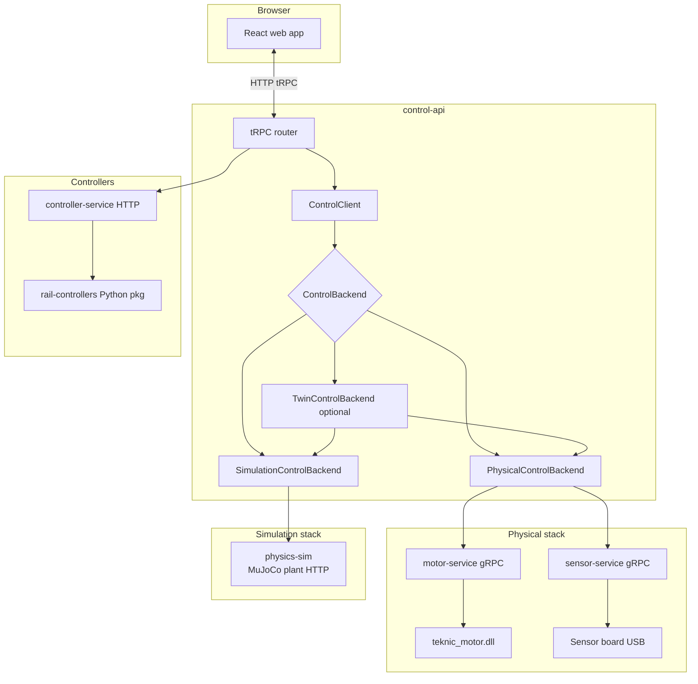
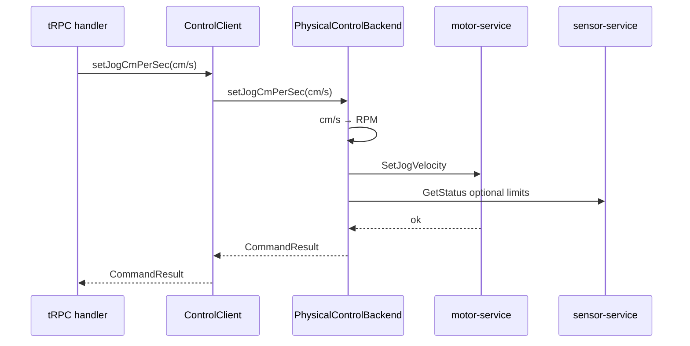
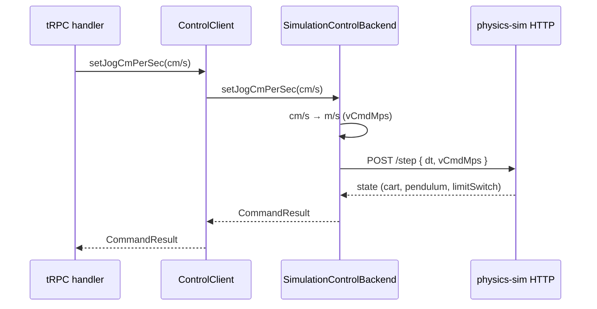
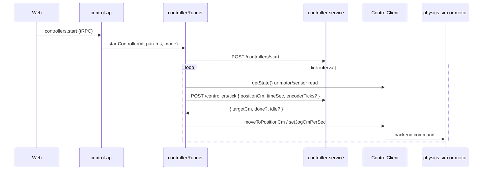
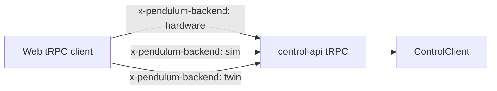

# Control client architecture

This document describes the **target** architecture for machine control in real-pendulum-2: a single control surface inside **control-api**, with pluggable backends for the physical bench and for MuJoCo simulation.

**Related:** stack overview in `[TECHDOC.md](./TECHDOC.md)`; simulation processes and MuJoCo in `[simulation-and-bench.md](./simulation-and-bench.md)`.

---

## 1. Goals


| Goal                    | Detail                                                                                                                                 |
| ----------------------- | -------------------------------------------------------------------------------------------------------------------------------------- |
| **Stable app API**      | Web and other callers use **tRPC on control-api** only. They do not talk to motor-service, sensor-service, or physics-sim directly.    |
| **Backend isolation**   | control-api routes all rail motion and sensor reads through a **ControlClient** that delegates to a **ControlBackend** implementation. |
| **Swappable execution** | The same ControlClient API works for **physical** hardware, **simulation** (MuJoCo), and (later) **twin** (both in parallel).          |
| **Mapping at the edge** | Protocol details (gRPC protos, Teknic counts, cm, MuJoCo state) stay inside backends—not in the UI.                                    |


Phase 1 focuses on **manual rail control** (connect, jog, stop, absolute move, travel limits, LED) and **state reads**. **Closed-loop controllers** live in a separate Python package (see §6)—not inside `physics-sim`.

---

## 2. Layered architecture




### Responsibility split


| Layer                              | Responsibility                                                                                                                                                                          |
| ---------------------------------- | --------------------------------------------------------------------------------------------------------------------------------------------------------------------------------------- |
| **Web**                            | UI, operator workflows, React Query / tRPC client. Sends **backend mode** (hardware / sim / twin) on requests; no gRPC to motor or sim processes.                                       |
| **control-api tRPC**               | Auth-less bench API: validation, motion latch, travel limits, controller runner. **Constructs ControlClient** from the requested mode and calls it.               |
| **ControlClient**                  | Thin façade: `getState`, `setJogCmPerSec`, `stop`, `moveToPositionCm`, `setTravelLimits`, `setLed`, connect/disconnect, etc. Delegates to the injected backend. Rail motion is in **cm** and **cm/s**—not motor RPM. |
| **PhysicalControlBackend**         | Uses **@real-pendulum/motor-service/sdk** and **sensor-service/sdk** against production URLs (Teknic + Arduino).                                                                        |
| **SimulationControlBackend**       | Talks **directly** to **physics-sim** HTTP (`GET /state`, actuator commands, `/step`). Maps MuJoCo plant state → `RailMachineState`. **No motor-service or sensor-service.**            |
| **TwinControlBackend** (planned)   | Composes physical + simulation backends so one command runs on **both** rails (current product behavior).                                                                               |
| **motor-service / sensor-service** | **Physical stack only** (Teknic DLL + USB sensor board). Not part of the simulation stack.                                                                                              |
| **physics-sim**                    | **Simulation plant only:** MuJoCo HTTP API (`/state`, `/step`, `/actuator`, …). Cart position, pendulum angle, virtual limit switches. **No closed-loop controllers.** |
| **rail-controllers**               | Python package of rail control algorithms (LQR, go-to-center, oscillate, …). **Moved out of** `apps/physics-sim/controllers/`. |
| **controller-service**             | Thin HTTP process hosting `rail-controllers` (`/controllers/list`, `/start`, `/stop`, `/tick`). **controllerRunner** in control-api orchestrates ticks + applies commands via ControlClient / motor. |


---

## 3. ControlClient (inside control-api)

The **ControlClient** is the only object tRPC procedures should use for “talk to the machine.”

```ts
// Conceptual — types live in control-api (or packages/rail-control later)

type ControlClientOptions = {
  backend: ControlBackend;
};

class ControlClient {
  constructor(private readonly options: ControlClientOptions) {}

  getState() {
    return this.options.backend.getState();
  }

  connect() {
    return this.options.backend.connect();
  }

  disconnect() {
    return this.options.backend.disconnect();
  }

  setJogCmPerSec(cmPerSec: number, opts?: JogOptions) {
    return this.options.backend.setJogCmPerSec(cmPerSec, opts);
  }

  stop() {
    return this.options.backend.stop();
  }

  moveToPositionCm(cm: number, opts?: MoveOptions) {
    return this.options.backend.moveToPositionCm(cm, opts);
  }

  setTravelLimits(limits: { left: number | null; right: number | null }) {
    return this.options.backend.setTravelLimits(limits);
  }

  setLed(on: boolean) {
    return this.options.backend.setLed(on);
  }
}
```

**ControlClient does not know** whether the backend is physical or simulation. It only forwards calls. Mode-specific behavior (e.g. firmware flash unavailable in sim) stays in tRPC handlers or the web layer via the selected backend mode.

---

## 4. ControlBackend interface

Backends implement a **rail-specific** contract (`cart`, `pendulum`, `led`, `limitSwitch`, `connection`), not a generic 6-DOF manipulator API.

```ts
type Unsubscribe = () => void;

type RailMachineState = {
  status: "idle" | "moving" | "latched" | "error" | "disconnected";
  connection: {
    /** Motor / rail (Teknic or sim plant actuator path). */
    cart: boolean;
    /** Sensor board: pendulum encoder, limit switches, LED. */
    sensor: boolean;
  };
  cart: {
    positionCm: number | null;
    commandedCmPerSec: number;
    /** Software travel limits (cm) for jog / move-to-position clamping. */
    travelLimitsCm: { left: number | null; right: number | null };
  };
  pendulum: {
    angleDeg: number;
  };
  led: {
    on: boolean;
  };
  limitSwitch: {
    leftPressed: boolean;
    rightPressed: boolean;
  };
  error?: ControlError;
};

interface ControlBackend {
  getState(): Promise<RailMachineState>;
  subscribeToState?(callback: (state: RailMachineState) => void): Unsubscribe;

  connect(): Promise<ConnectResult>;
  disconnect(): Promise<void>;
  setJogCmPerSec(cmPerSec: number, opts?: JogOptions): Promise<CommandResult>;
  stop(): Promise<CommandResult>;
  moveToPositionCm(cm: number, opts?: MoveOptions): Promise<CommandResult>;

  /** Software travel limits (cm) — same shape as `getState().cart.travelLimitsCm`. */
  setTravelLimits(limits: { left: number | null; right: number | null }): Promise<CommandResult>;
  setLed(on: boolean): Promise<CommandResult>;
}
```

**tRPC mapping (stable procedure names → ControlClient):**

| tRPC procedure | ControlClient method |
| -------------- | -------------------- |
| `rail.limits.set` (today: `rail.limits.record`, `rail.limits.setSymmetricSpan` — thin wrappers compute `left`/`right` then call below) | `setTravelLimits({ left, right })` |
| `sensor.led.set` (today: `sensor.led.toggle` — wrapper reads current `led.on` and flips, or passes explicit `on`) | `setLed(on)` |

Travel limits are **software bounds** (cm) for jog clamping, move-to-position, and the UI slider—not the physical limit switches. Hardware limit switches are **`limitSwitch.leftPressed` / `limitSwitch.rightPressed`**. The web or tRPC layer may derive `{ left, right }` from a limit-switch hit or a symmetric span; **ControlClient** only sets the resulting cm values. Stored limits are **per backend mode** (hardware vs sim), same as today’s `railTravelLimits` module.

Optional later split (only if needed): `ControllerBackend` for closed-loop start/stop—so backends are not forced to fake unsupported methods.

---

## 5. Backend implementations

### 5.1 PhysicalControlBackend

**Purpose:** Real Teknic motor and USB sensor board.


| Concern | Implementation                                                                                                                                                       |
| ------- | -------------------------------------------------------------------------------------------------------------------------------------------------------------------- |
| Motor   | `motor-service` gRPC (`Connect`, `SetJogVelocity`, `Stop`, `MoveToPosition`, `GetStatus`, …) — **PhysicalControlBackend converts cm/s ↔ RPM** at this boundary only. `connection.cart` from motor connect status. |
| Sensor  | `sensor-service` gRPC (limits, encoder ticks, LED, connect) — **PhysicalControlBackend converts encoder ticks → `angleDeg`**; maps limit switches → `limitSwitch`, LED → `led`. `connection.sensor` from sensor connect status. |
| Travel limits | `setTravelLimits({ left, right })` stores cm bounds server-side; exposed in `getState().cart.travelLimitsCm`. |
| LED     | `sensor-service` set LED command via `setLed(on)`; `led.on` reflected in `getState().led`. |
| URLs    | `config.motor.grpcUrl` / `config.sensor.grpcUrl` (defaults 50051 / 50052)                                                                                            |
| Mapping | Teknic measured counts ↔ cm via `railPositionCm`; encoder ticks ↔ degrees for pendulum; normalized `RailMachineState` and `ControlError`                             |





### 5.2 SimulationControlBackend

**Purpose:** Same operator API as hardware, but state and motion come from **MuJoCo** via a **direct HTTP client**—not via motor/sensor gRPC.

The simulation stack is **physics-sim only** (`apps/physics-sim`). control-api reads plant state and sends actuator commands there; it does **not** start or call `serve:simulation`, `simulationGrpcServer`, or the motor/sensor SDKs in sim mode. **Controllers are not part of physics-sim** (see §6).


| Concern                     | Implementation                                                                                           |
| --------------------------- | -------------------------------------------------------------------------------------------------------- |
| **Read state**              | `GET /state` → cart `xM`, `vMps`, pendulum `thetaRad`, `omegaRps`, limit switches                        |
| **Actuator command**        | `POST /actuator` or `POST /step` with `xRefM` (position setpoint, m) and/or `vCmdMps` (velocity command) |
| **Advance time**            | `POST /step` `{ dt, … }` after setting actuator command                                                  |
| **Reset / config**          | `POST /reset`, `PATCH /config`                                                                           |
| **TS client**               | `@real-pendulum/physics-sim/client` (`physicsSimGetState`, `physicsSimStep`, …)                          |
| **Mapping**                 | Backend converts m ↔ cm, `thetaRad` ↔ `angleDeg`, limit booleans → `limitSwitch.leftPressed` / `rightPressed`. Sim: `connection.cart` / `connection.sensor` true when physics-sim is reachable (no USB). |
| **Travel limits**           | Same server-side limit store as hardware (separate sim bucket); `setTravelLimits` writes cm bounds from tRPC/UI. |
| **LED**                     | `setLed(on)` updates `led.on` in state (sim mirrors the same field). |


#### physics-sim HTTP contract (simulation boundary)


| Method | Path             | Role                                                                                        |
| ------ | ---------------- | ------------------------------------------------------------------------------------------- |
| GET    | `/health`        | Liveness                                                                                    |
| GET    | `/state`         | Full plant state + config (single source of truth for sim reads)                            |
| POST   | `/actuator`      | Set cart actuator command (`xRefM` and/or `vCmdMps`); optional `dt` to step in same request |
| POST   | `/step`          | Advance physics by `dt` (may include actuator fields)                                       |
| POST   | `/reset`         | Reset initial conditions                                                                    |
| PATCH  | `/config`        | Patch plant parameters (gravity, limits, encoder scale, …)                                  |
| POST   | `/move_absolute` | Convenience: drive cart to target via position actuator                                     |


Actuator model in MuJoCo: **position servo** on `cart_slide` (`ctrl` = cart target position in meters). Jog maps **cm/s → m/s** (`vCmdMps`); absolute move maps **cm → m** (`xRefM`).




#### Legacy note (do not use for new sim work)

`serve:simulation` / `simulationGrpcServer` (MotorService + SensorService facades over physics-sim) exists in the repo today for **backward compatibility** during migration. It is **not** the target simulation architecture and should not be extended.

### 5.3 TwinControlBackend (planned)

**Purpose:** One operator action drives **both** physical and simulated rails (today’s **Twin** mode).

- **Commands:** delegate to `PhysicalControlBackend` and `SimulationControlBackend` in parallel (e.g. `Promise.all`).
- **State for main UI:** typically **hardware** cart/limits; **sim** snapshot exposed separately for Digital Twin view (as today with `twin.status.get` real/sim split).
- **Implementation note:** Prefer a single composite backend inside control-api rather than duplicating `twin.`* tRPC trees long term.

### 5.4 MockControlBackend (tests)

In-memory backend for unit tests and local UI work without processes. Used from Vitest in control-api and optionally from web Storybook later.

---

## 6. Rail controllers (outside physics-sim)

**Today:** controller implementations live under `apps/physics-sim/controllers/` and are served from the physics-sim HTTP server (`POST /controllers/*`). **Target:** move them **out of** `apps/physics-sim` so the sim process is **plant-only** (MuJoCo state + actuators).

### 6.1 Layout (target)

```
packages/rail-controllers/              # Python package — moved from apps/physics-sim/controllers/
  pyproject.toml
  rail_controllers/
    __init__.py
    registry.py                         # discover METADATA + create() per controller module
    service.py                          # active controller lifecycle (start / stop / tick)
    lqr_common.py
    lqr_position.py
    go_to_center.py
    oscillate_position.py
    ...

apps/controller-service/                # thin HTTP wrapper (separate dev process)
  src/
    server.py                           # /controllers/list, /status, /start, /stop, /tick
  package.json                          # npm script to start alongside physics-sim

apps/physics-sim/                       # plant only — no controllers/ directory
  cart_pendulum/
    server.py                           # /state, /step, /actuator, /reset, /config only
```

Individual controller modules stay **Python** (LQR notebooks and `mjd_transitionFD` tuning remain in `notebooks/`). The package exposes a small **`tick(state) → command`** contract; it does not import MuJoCo or talk to the plant directly.

### 6.2 Runtime flow



**controllerRunner** (control-api) owns the loop: read rail/pendulum state, call **controller-service** for the next command, apply it through **ControlClient** (physical or sim backend). Controllers never call motor-service or physics-sim HTTP themselves.

### 6.3 controller-service HTTP contract

| Method | Path                 | Role                                      |
| ------ | -------------------- | ----------------------------------------- |
| GET    | `/health`            | Liveness                                  |
| GET    | `/controllers/list`  | Controller metadata (id, name, params)    |
| GET    | `/controllers/status`| Active controller id, step count, error   |
| POST   | `/controllers/start` | `{ id, params? }` — load controller       |
| POST   | `/controllers/stop`  | Clear active controller                   |
| POST   | `/controllers/tick`  | `{ positionCm, timeSec, encoderTicks? }` → command |

TS client: `@real-pendulum/controller-service/client` (extracted from today's `@real-pendulum/physics-sim/client` controller helpers).

### 6.4 Migration from today

| Today | Target |
| ----- | ------ |
| `apps/physics-sim/controllers/*.py` | `packages/rail-controllers/rail_controllers/*.py` |
| `/controllers/*` on physics-sim (58871) | `/controllers/*` on **controller-service** (separate port, e.g. 58872) |
| `physicsSimControllersTick` in `@real-pendulum/physics-sim/client` | `controllerServiceTick` in `@real-pendulum/controller-service/client` |
| `controllerRunner` → physics-sim HTTP | `controllerRunner` → controller-service HTTP + ControlClient for actuation |

---

## 7. Web ↔ control-api

The web app **only** uses the generated tRPC client (`apps/web/src/trpc.ts`).


| Today                                               | Target                                                                                                                                    |
| --------------------------------------------------- | ----------------------------------------------------------------------------------------------------------------------------------------- |
| `grpcBackendModeAtom` + header `x-pendulum-backend` | Unchanged at the HTTP boundary: web still selects `hardware` | `sim` | `twin`.                                                            |
| tRPC calls `jog.`*, `twin.jog.*`, etc.              | tRPC handlers create `ControlClient` with the right backend; **procedure surface can stay stable** while internals move to ControlClient. |
| Direct knowledge of sim URLs                        | Web only sees backend mode hints via tRPC meta—not for direct HTTP/gRPC to physics or motor processes.                                    |





---

## 8. Backend selection (factory)

control-api chooses the backend from request context (middleware), not the web:

```ts
type ControlMode = "hardware" | "sim" | "twin";

function createControlClient(mode: ControlMode): ControlClient {
  switch (mode) {
    case "hardware":
      return new ControlClient({ backend: new PhysicalControlBackend() });
    case "sim":
      return new ControlClient({ backend: new SimulationControlBackend() });
    case "twin":
      return new ControlClient({ backend: new TwinControlBackend() });
  }
}
```

- **PhysicalControlBackend:** SDK clients with `withMotorGrpcBaseUrl` / `withSensorGrpcBaseUrl` (existing pattern in `twinGrpc.ts`).
- **SimulationControlBackend:** `@real-pendulum/physics-sim/client` only (`PHYSICS_SIM_URL`, default `http://127.0.0.1:58871`). No gRPC URL wiring.

---

## 9. What stays outside ControlClient (initially)

These remain dedicated control-api modules until there is a clear benefit to folding them in:


| Module               | Reason                                                                     |
| -------------------- | -------------------------------------------------------------------------- |
| **motionLatch**      | Global safety FSM; cross-cutting                                           |
| **controllerRunner** | Closed-loop tick loop → **controller-service** HTTP; reads state and actuates via **ControlClient** (not physics-sim). |
| **Firmware flash**   | Sensor-service admin; not rail motion                                      |


---

## 10. Proposed folder layout (control-api)

```
apps/control-api/src/
  control/
    ControlClient.ts
    ControlBackend.ts
    types.ts
    factories/
      createControlClient.ts
    backends/
      PhysicalControlBackend.ts
      SimulationControlBackend.ts
      TwinControlBackend.ts
      MockControlBackend.ts
    mappers/
      physicalMappers.ts      # Teknic counts, sensor proto → RailMachineState
      simulationMappers.ts    # physics-sim JSON → RailMachineState
  router.ts          # tRPC → createControlClient(mode) → ControlClient
  twinGrpc.ts        # may shrink once backends own URL wiring
```

A future `**packages/rail-control**` could extract the same types/backends if the web ever needs a shared contract without duplicating types.

---

## 11. Runtime processes (dev)

### Hardware mode


| Process              | Port (default) | Used by                  |
| -------------------- | -------------- | ------------------------ |
| motor-service        | 50051          | PhysicalControlBackend   |
| sensor-service       | 50052          | PhysicalControlBackend   |
| **controller-service** | 58872        | controllerRunner         |
| control-api          | 4000           | Web tRPC                 |
| web (Vite)           | 5173           | Browser                  |

Controllers use the same **controller-service** in hardware and sim; only the **ControlClient** backend changes for actuation.

### Simulation mode (target)


| Process                         | Port (default) | Used by                  |
| ------------------------------- | -------------- | ------------------------ |
| **physics-sim** (MuJoCo plant)  | 58871          | SimulationControlBackend |
| **controller-service**          | 58872          | controllerRunner         |
| control-api                     | 4000           | Web tRPC                 |
| web (Vite)                      | 5173           | Browser                  |


Simulation mode does **not** require motor-service, sensor-service, or `serve:simulation`. **physics-sim** does not expose `/controllers/*`.

### Twin mode

All hardware processes **plus** physics-sim (58871) and controller-service (58872). PhysicalControlBackend and SimulationControlBackend run in parallel inside TwinControlBackend.

### Legacy (migration only)


| Process          | Port  | Status                                                                                               |
| ---------------- | ----- | ---------------------------------------------------------------------------------------------------- |
| serve:simulation | 58870 | Deprecated — gRPC facades; remove once SimulationControlBackend uses physics-sim directly everywhere |


---

## 12. Acceptance criteria

The architecture is in place when:

1. **Web** talks only to **control-api** (tRPC)—unchanged from an operator perspective.
2. **control-api** exposes a **ControlClient** used by jog/move/status, travel limits, and sensor LED procedures.
3. **PhysicalControlBackend** drives **motor-service** + **sensor-service** (real hardware).
4. **SimulationControlBackend** talks **directly** to **physics-sim** HTTP (get state, set actuator, step)—no motor/sensor gRPC; **no** `/controllers/*` on physics-sim.
5. **Rail controllers** live in **`packages/rail-controllers`**; **controller-service** exposes `/controllers/*`; **controllerRunner** orchestrates ticks + ControlClient actuation.
6. Unit conversion and proto mapping live in **backends**, not in React components.
7. Tests cover ControlClient delegation and at least one real backend (mock + physical or sim mapper tests).

---

## 13. Non-goals

- Replacing **protobuf** on the **physical** stack (motor-service / sensor-service remain for hardware).
- **Simulation stack:** no motor/sensor gRPC facades in the target design (`serve:simulation` is legacy only).
- Implementing a new physics engine (MuJoCo remains in `apps/physics-sim` **plant code only**).
- Embedding closed-loop controllers inside **physics-sim** (they belong in **`packages/rail-controllers`**).
- Generic robot APIs (`moveLinear`, tool pose, IO banks) in v1.
- Web calling **motor-service**, **sensor-service**, or **physics-sim** directly (always via control-api tRPC).
- Rewriting the entire **twin.*** tRPC router in the first PR (can follow once ControlClient exists).

---

## 14. Migration outline


| Step | Work                                                                                                         |
| ---- | ------------------------------------------------------------------------------------------------------------ |
| 1    | Add `control/` types, `ControlBackend`, `ControlClient`, `MockControlBackend`.                               |
| 2    | Implement `PhysicalControlBackend` (motor/sensor SDK + mappers).                                             |
| 3    | Implement `SimulationControlBackend` (**physics-sim HTTP client** + `simulationMappers`; no gRPC).           |
| 4    | Wire `jog.setCmPerSec`, `jog.stop`, `rail.limits.*`, `sensor.led.set`, `status.get`, `connection.*` through `createControlClient`. |
| 5    | Implement `TwinControlBackend`; collapse duplicate tRPC where safe.                                          |
| 6    | Migrate remaining rail procedures (move absolute, zero, homing).                                   |
| 7    | Remove sim-mode dependency on `serve:simulation` / `simulationGrpcServer`; update `npm run dev` sim profile. |
| 8    | Move `apps/physics-sim/controllers/` → **`packages/rail-controllers`**; add **`apps/controller-service`**; remove `/controllers/*` from physics-sim; point `controllerRunner` at controller-service. |
| 9    | Optional: extract `packages/rail-control`; document in TECHDOC link.                                         |


---

## 15. Open decisions

Track answers here as the design is finalized:

- Twin: composite commands only vs read-only twin for hardware.
- Whether `subscribeToState` is required or React Query polling stays.
- Controllers stay in **controllerRunner** + **controller-service** (not ControlClient methods).
- **controller-service** port and env var name (`CONTROLLER_SERVICE_URL`, default 58872).
- Package extraction timing (`control-api` only vs `packages/rail-control`).
- Exact physics-sim actuator API shape (`POST /actuator` vs overloaded `/step` only).
- Sim-mode `connect` / `disconnect` semantics (no USB—likely no-op or reset plant).

