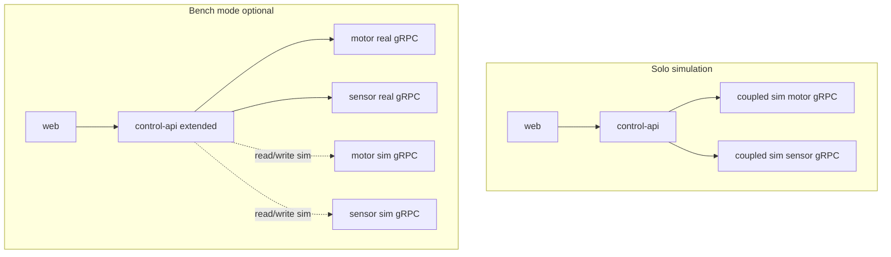
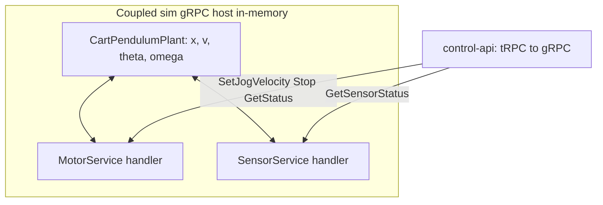

# Simulation & bench mode — technical design

This document extends the stack overview in [`TECHDOC.md`](./TECHDOC.md). It describes how to run the application **without physical motor or sensor hardware**, how to combine **live hardware with a coupled plant simulation** for comparison, **§2.2** (coupled sim motor and sensor as **two facades over one plant**), how **`CartPendulumPlant`** maps onto gRPC (**§3.5**), and the **`@real-pendulum/physics-sim`** MuJoCo service.

---

## 1. Goals

| Goal | Description |
|------|-------------|
| **Solo simulation** | Developers and CI can run **web + control-api** against **simulated gRPC backends** (or in-process stubs) so jog, homing, limits, and pendulum-related UI are exercisable without Teknic DLL or USB serial. |
| **Bench / twin mode** | Optionally connect **both** real motor/sensor services **and** simulation backends so the UI or logs can show **reality vs simulation** side by side (positions, encoder, limits, homing traces). |
| **Coupled physics** | The pendulum should respond to **gravity** and to **cart acceleration** (non-inertial pivot motion), not only an independent scripted encoder. |

---

## 2. Architectural principles

### 2.1 One tRPC contract; swap gRPC backends

**Keep one tRPC contract; vary what sits behind gRPC.**

- Today, **`apps/control-api`** calls **`@real-pendulum/motor-service/sdk`** and **`@real-pendulum/sensor-service/sdk`** (see `router.ts`, `homing.ts`). URLs come from **`packages/app-config/src/config.ts`** (hardware) and **`config.sim`** (simulator).
- **Simulation** should implement the **same protos and RPCs** as production (or a documented subset), so **homing, limits, jog, and UI-facing procedures stay identical** whether the backend is hardware or simulated. **You do not branch business logic** (“if sim then … else …”) inside **`control-api`** for behavior that already exists behind the motor/sensor SDK — only the **target URL** (or an extra bench client) changes.
- The repo includes a **coupled sim gRPC** entrypoint: `apps/control-api/scripts/serve-coupled-sim-grpc.ts` → `@real-pendulum/motor-service/test-support/coupled-sim-server` (motor + sensor, one plant; see **§3.5**).

### 2.2 Two gRPC facades, one shared plant (solo sim)

In **solo simulation**, treat the **simulated `MotorService`** and **simulated `SensorService`** as **two thin RPC facades over the same in-memory `CartPendulumPlant`**: both handlers read/write the **identical** `x`, `v`, `θ`, `ω`, and encoder integral. **§3.5** spells out how each RPC maps onto that state; **§3** below walks setup before diving into those mappings.

---

## 3. Solo simulation (no hardware)

In the coupled design, **coupled sim** and **coupled sim sensor** processes are **not** two independent worlds: they are **two gRPC interfaces** into **one plant** (see **§2.2**). The subsections below separate concerns for readability; implementation should keep a **single** integrator state.

### 3.1 Motor

- Run or extend the **simulated `MotorService`** so it exposes believable **`status.get`** fields (measured position, commanded RPM, connection flags) and implements **jog / stop / connect** used by the UI.
- Integrate **cart motion** with the plant (below): either the coupled sim owns the integrator that updates `x`, or a **combined “hardware sim”** process owns both motor and sensor state and implements both protos.

### 3.2 Sensor

- Provide a **simulated `SensorService`** (or `sensor-service` dev mode) that returns **`getSensorStatus`** payloads: `encoderTicks`, `limitLeftPressed`, `limitRightPressed`, `connected`, etc.
- **Limits**: derive from **simulated cart position** vs recorded left/right thresholds (same semantics as rising-edge capture on the real rig).
- **Encoder**: drive from the **pendulum shaft angle** in the plant (equations in **§5**; how that maps onto gRPC fields in **§3.5**), not from a disconnected counter unless you are doing a very early smoke test.

### 3.3 control-api & homing

- Prefer **`runRailHoming()` unchanged**, calling the same SDK; only the process behind gRPC changes.
- **Travel limits** and any persisted server state in sim can use **in-memory** defaults or a small **JSON/SQLite** file for repeatable demos.

### 3.4 Web

- Optional: show a **“SIM”** badge when the API exposes metadata (e.g. `status.get.detail` or a dedicated `meta` query) indicating simulation backends.

### 3.5 How physics drives coupled sim motor and sensor gRPC

When **`control-api`** is pointed at **simulated** motor and/or sensor processes (instead of the DLL-backed motor service and USB-backed sensor service), the **same protobuf RPCs** apply, but **state comes from one coupled `CartPendulumPlant`** (in-memory mirror synced via **`@real-pendulum/physics-sim/client`**) instead of Teknic and the Sensor Board. Physics runs in **MuJoCo** (`apps/physics-sim`); see **§5** for the HTTP API and plant mirror types.

The **coupled sim** and **coupled sim sensor** handlers are **facades** over this one object (**§2.2**): **`GetStatus`** and **`GetSensorStatus`** must reflect the **same** step of physics.

#### Commanded vs effective velocity vs what the UI reads

| Quantity | Meaning |
|----------|---------|
| **`vCmdMps`** | Commanded cart speed from jog/profile (after RPM→m/s); the plant **tracks** this with lag **α**. |
| **`vMps`** | **Effective** cart velocity after dynamics (\(\dot x = v\), \(\dot v = \alpha(v_{\text{cmd}}-v)\)). |
| **`xM`** | Cart position (m); becomes **measured / display counts** on the motor status path after calibration and **the same sign rules** as production. |
| **Encoder / limits** | From **`ω`**, **`θ`**, and **`xM`** on the **sensor** path (see tables below). |

#### End-to-end jog example (solo sim)

1. Operator **jog** in the UI → **`control-api`** → **`SetJogVelocity`** (RPM) on the coupled sim.  
2. Coupled sim maps **RPM → `vCmdMps`**, stores on **`plant.state.vCmdMps`**.  
3. On each poll (or timer), the coupled sim server computes **`dt`**, calls **`physics-sim` `POST /step`** → updates **`xM`**, **`vMps`**, **`θ`**, **`ω`**, encoder integral.  
4. **`GetStatus`** returns **`xM` / `vMps`** (via counts + RPM fields expected by the UI).  
5. **`GetSensorStatus`** returns **`encoderTicksInt(plant)`**, **limit booleans** from **`xM`** vs thresholds, **`connected`**.

> **Time stepping (do not skip):** Physics must **not** advance only when a write RPC arrives. Between calls, integrate with real **`dt`** (wall clock or fixed sim clock): on each **`GetStatus`** and/or a **background timer**, compute **`dt`** since the last step and call **`physics-sim` `/step`**. A purely **request-driven** integrator (advancing only on `SetJogVelocity`) produces **inconsistent** motion and wrong coupling when the UI polls slowly.

#### Simulated `motor.v1.MotorService`

| RPC / field | Physical motor | Sim-driven by plant |
|-------------|------------------|----------------------|
| **SetJogVelocity** (RPM) | Teknic `MoveVelStart` | Map RPM → **`plant.state.vCmdMps`** (m/s) using belt/reel geometry. |
| **Stop** | Zero velocity command | Set **`vCmdMps = 0`**; cart velocity still decays with lag **α** toward zero; the **pendulum keeps swinging** under gravity and coupling until damped. |
| **GetStatus** → measured position | `PosnMeasured` from drive | Convert **`plant.state.xM`** to Teknic/display counts with the same **meters-per-count** calibration and **sign convention** as production (`motorCountsForDisplay` / `teknicDisplayCounts` in **`control-api`** must match the sim). |
| **GetStatus** → commanded RPM | Echo of jog | Echo last commanded RPM, or derive from **`v`** if the sim reports an effective command. |
| **Connect / Disconnect** | Open / close hub | Reset or freeze the plant (define explicitly, e.g. reset **`x, v, θ, ω`** and encoder integral on connect). |

#### Simulated `sensor.v1.SensorService`

| Field / behavior | Physical Sensor Board | Sim-driven by same plant |
|------------------|----------------------|---------------------------|
| **encoderTicks** | Quadrature from pendulum shaft | **`encoderTicksInt(plant)`** from **`plant.state.encoderTicksFloat`** (integrates **ω** with **`encoderTicksPerRadian`**). |
| **limitLeftPressed** / **limitRightPressed** | Digital inputs D4/D5 | Compare **`plant.state.xM`** to stored **left/right** stop positions; assert when the cart crosses the threshold (optional hysteresis). |
| **connected** | Serial session | **`true`** when the sim session is “open”; no USB required. |

Limit positions can mirror **recorded travel limits** (file-backed) or fixed demo values.

#### Why one shared plant (reprise)

This repeats **§2.2** for readers who jump straight here: if motor and separate sim backends used **independent** integrators, the rail UI and encoder would **drift apart** and limits would not match cart motion. **One plant**, two gRPC facades, keeps **rail position, encoder angle, and limit switches** aligned with the **same** MuJoCo step.

#### Implementation pointers

- **Coupled sim (one `CartPendulumPlant`, two facades):** `@real-pendulum/motor-service/test-support/coupled-sim-server` — `createCoupledSimGrpcModel`, `startCoupledSimGrpcServer`; registers **`motor.v1.MotorService`** and **`sensor.v1.SensorService`** on one HTTP port.

##### Running the coupled sim daemon

- **From motor-service:** `npm run serve:coupled-sim -w @real-pendulum/motor-service`
- **From control-api (re-exports same server):** `npm run serve:coupled-sim -w @real-pendulum/control-api`
- Hardware URLs: **`motorGrpcBaseUrl()`** / **`sensorGrpcBaseUrl()`** (defaults **50051** / **50052**).
- **Web “Simulator”** mode uses **`resolveSimMotorGrpcUrl()`** / **`resolveSimSensorGrpcUrl()`** (default coupled sim **58870** on **`config.sim.coupledGrpcPort`**). The browser sends **`x-pendulum-backend: sim`**; **Hardware** uses config hardware URLs.
- Tunables: **`config/coupled-sim.parameters.json`** (`mpsPerRpm`, plant). Sim limit positions: **`config.sim.limitLeftXM`** / **`limitRightXM`** in `packages/app-config/src/config.ts`. Rail cm scale comes from **`config.rail.displayCountsPerCm`** (shared with hardware).

---

## 4. Bench mode — hardware + simulation together

### 4.1 Motivation

Operators may want to **mirror commands** into a sim plant while driving the real cart, or **replay** the same jog sequence and compare encoder and rail position **without blending real and simulated telemetry into one ambiguous stream** (bench responses should name **`real`** vs **`sim`** explicitly).

### 4.2 Recommended API shapes

Pick one pattern (or evolve from A → B):

| Pattern | Pros | Cons |
|--------|------|------|
| **A — Dual config, dual tabs** | Two `control-api` instances (real vs sim URLs); zero router changes. | Two browsers / two URLs; awkward UX. |
| **B — Dual gRPC clients in one API** | One UI; explicit `bench.snapshot` or `sim.*` procedures. | `control-api` holds two motor + two sensor clients when sim URLs are set in config. |
| **C — Mirror router** | `sim.status.get`, `sim.jog.setVelocity`, … clear naming. | More procedures to maintain. |

**Safety default:** **writes** (jog, home, move) should target **either** real **or** sim per explicit operator mode. **Read-only** bench queries can always return `{ real, sim }` when both backends are configured.

### 4.3 Suggested `config` fields (illustrative)

| Field | Role |
|-------|------|
| `motor.grpcUrl` / `motor.grpcPort` | Primary motor backend (hardware or simulated). |
| `sensor.grpcUrl` / `sensor.grpcPort` | Primary sensor backend. |
| `sim.motorSimGrpcUrl` | Optional sim motor URL; if unset, coupled sim default (**58870**). |
| `sim.sensorSimGrpcUrl` | Optional sim sensor URL; if unset, uses motor sim URL or coupled default. |
| `sim.coupledGrpcPort` | Coupled sim listen port (`serve:coupled-sim`). |
| `BENCH_COMMAND_TARGET` (future) | `real` \| `sim` \| `both` (if `both` is ever allowed, document hazards). |

### 4.4 Web UX

- **Split columns** or **overlay** for rail + pendulum schematic fed from `real` vs `sim` props.
- Optional **CSV / structured log** export: timestamp, real display counts, sim display counts, encoder ticks both sides, commanded RPM.

---

## 5. Coupled cart–pendulum physics

**Runtime engine:** [`apps/physics-sim`](../apps/physics-sim/) — **Python + MuJoCo** HTTP service (default `http://127.0.0.1:58871`).  
**TypeScript bridge:** `apps/physics-sim/client` (`physicsSimClient`, replay helpers).  
**gRPC facades:** `apps/motor-service` coupled sim (§3.5) steps the live plant over HTTP on each status poll.

### 5.1 State & parameters

- **State:** `xM` (cart position, m, +right), `vMps`, `thetaRad` (angle CCW from straight down), `omegaRps`, `vCmdMps` (commanded cart velocity from motor/jog model), `encoderTicksFloat` (continuous integral for quadrature ticks).
- **Config:** `gravity`, `pendulumLengthM`, `cartVelocityTrackingPerSec` (cart velocity actuator gain), `angularDampingPerSec` (hinge damping), `maxInternalStepSec`. Encoder ticks/radian comes from **`config.pendulum.encoderCountsPerRevolution`** (shared with hardware).

### 5.2 MuJoCo model

- Cart **slide** joint on +X; pendulum **hinge** on +Y (swing in X–Z).
- Cart **velocity actuator** tracks `vCmdMps`; pendulum motion couples through rigid-body dynamics.
- Tunables are patched at runtime via `PATCH /config` (see `apps/physics-sim/README.md`).

### 5.3 HTTP API (live plant + stateless replay)

| Method | Path | Purpose |
|--------|------|---------|
| POST | `/step` | Advance live plant `{ dt, vCmdMps? }` |
| POST | `/replay` | Stateless twin replay for calibration |
| PATCH | `/config` | Update plant parameters |

### 5.4 TypeScript exports

| Export | Purpose |
|--------|---------|
| `physicsSimStep`, `physicsSimReset`, `physicsSimReplay` | HTTP client to MuJoCo service |
| `createCartPendulumPlant`, `encoderTicksInt` | In-memory state mirror (synced from physics-sim) |

### 5.5 Wiring checklist (implementers)

1. **RPM → m/s:** map jog / profile **commanded RPM** to **`vCmdMps`** using belt/reel geometry (meters per motor revolution).
2. **Cart position → Teknic / display counts:** map `xM` to measured position with the **same sign convention** as `motorCountsForDisplay` / `teknicDisplayCounts` in control-api (avoid a second sign bug vs `RailPendulumSchematic`).
3. **Limits:** when `xM` crosses stored left/right thresholds (m), set `limitLeftPressed` / `limitRightPressed` with optional debounce/hysteresis to match mechanical switches.
4. **Encoder ↔ UI:** if the schematic’s horizontal deflection was flipped for the real encoder, apply the **same mapping** from `theta` / ticks in sim.

---

## 6. Phased implementation roadmap

| Phase | Deliverable |
|-------|-------------|
| **1** | Documented scripts: coupled sim (+ minimal status) sufficient for web smoke; CI runs control-api tests against sim backends. |
| **2** | Simulated **sensor** + limit logic from sim `xM`; encoder from physics-sim. |
| **3** | **Coupled** plant in one process; homing against sim limits end-to-end. |
| **4** | **Bench:** second gRPC client pair + tRPC read (and optional guarded write) + web split view. |
| **5** | Optional **replay / log comparison** and parameter tuning UI (L, g, damping) for education. |

---

## 7. Testing strategy (cross-reference)

- **Unit:** `pip install -r apps/physics-sim/requirements.txt && npm test -w @real-pendulum/physics-sim` (MuJoCo). Node tests auto-start physics-sim via Vitest global setup.
- **Integration:** control-api against coupled sim motor and sensor in CI (no DLL, no serial). See also [`testing-strategy.md`](./testing-strategy.md).

---

## 8. Open decisions

- **Process topology:** separate `motor-sim` + `sensor-sim` binaries vs one **combined daemon** with shared plant state (combined is simpler for coupling).
- **Command mirroring:** whether `control-api` duplicates jog RPCs to sim automatically or the UI opts in per action.
- **Session fidelity:** whether sim loads **recorded** `travelLimits` from disk to mimic a specific lab session vs always using synthetic defaults.

---

## 9. Revision history

| Date | Change |
|------|--------|
| 2026-05-12 | Review pass: §2 split + no branching logic; §2.2 dual facades; §3 intro; velocity table + E2E jog flow; time step callout; bench wording; §3.5 “Why” reprise. |
| 2026-05-12 | Simulator gRPC URLs default to coupled sim host/port (**`SIM_COUPLED_GRPC_PORT`**); **`MOTOR_SIM_GRPC_URL`** optional. |
| 2026-05-12 | Initial doc: simulation, bench mode, and physics-sim integration notes. |
